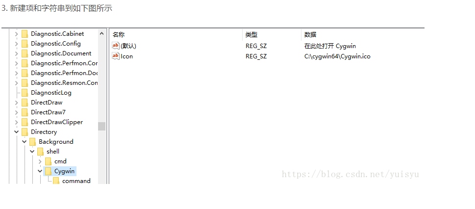
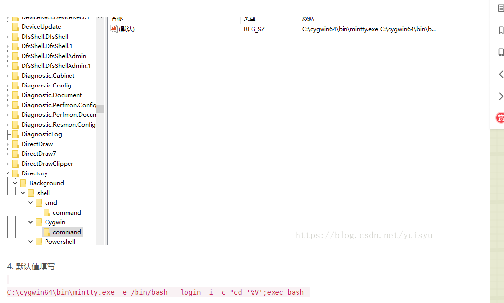

安装

 

# 右键添加在此处打开cygwin

步骤： 
1. 开始菜单运行 regedit 打开注册表 
2. 定位到 
`计算机\HKEY_CLASSES_ROOT\Directory\Background\shell\Cygwin\command `     （没有cygwin目录需要自己新增）

在 “cygwin” 下默认字符串数值的数据改为 “Cygwin” (显示在右键弹出菜单中的名字)

在 “cygwin” 下建立新的字符串值, 名称为 “ICON”, 数据为 “C:/cygwin64/Cygwin-Terminal.ico” (显示在或键弹出菜单中的图标)

在 “command” 项下将默认的字符串数值修改为 C:\cygwin64\bin\mintty.exe -i /Cygwin-Terminal.ico -c "cd %V"

以实际的安装目录为准，比如安装d盘，就需要更改路径

https://blog.csdn.net/yuisyu/article/details/81293333