创客学院linux下文件IO精讲

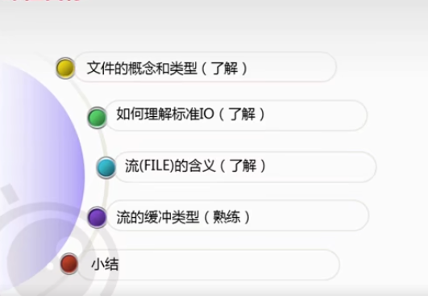

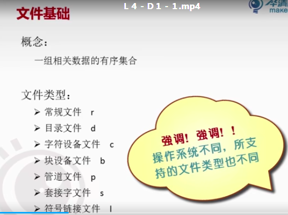

标准I/O实现了缓冲机制，原理是不管应用层需要多少，先读取一定量的数据放入缓存区，然后在下次应用层在请求时，直接从缓存区里读取，

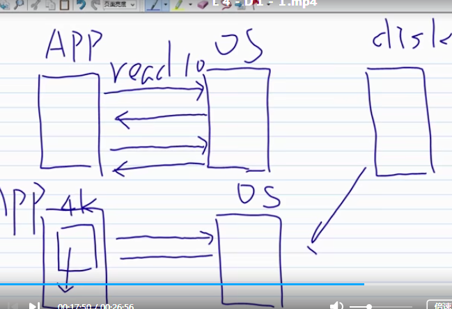

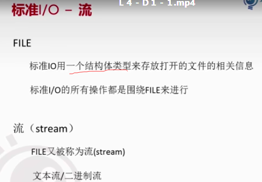

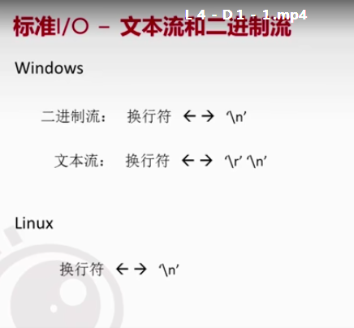

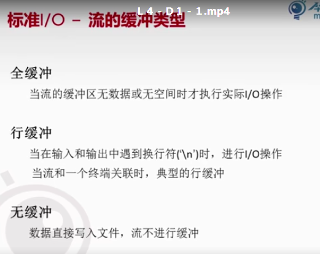

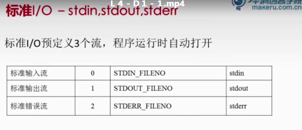

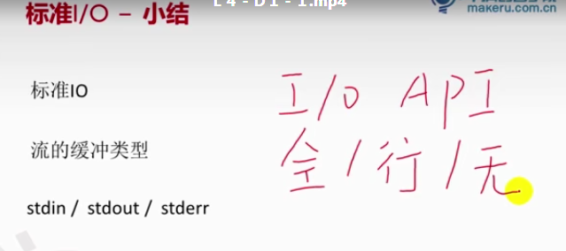

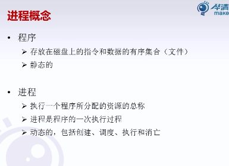

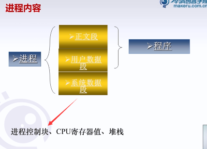

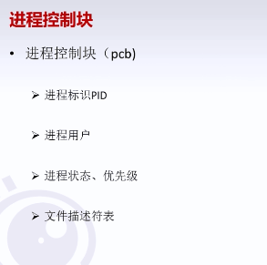

​					寄存器：进程下一条指令的内存地址。

​	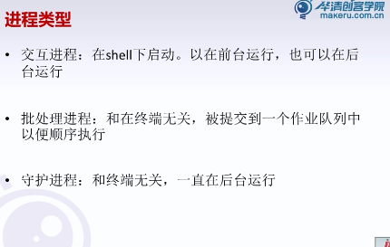

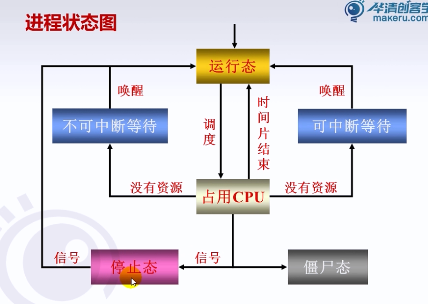

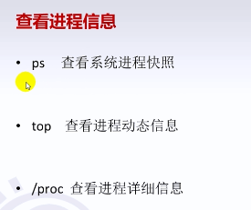

renice  改变进程优先级 -20到+19之间 越小优先级越高（通过NI来看优先级）

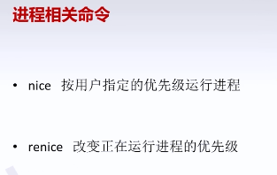

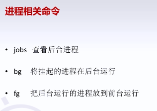

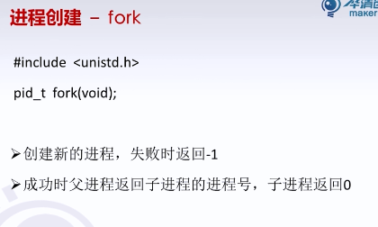

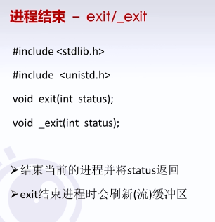

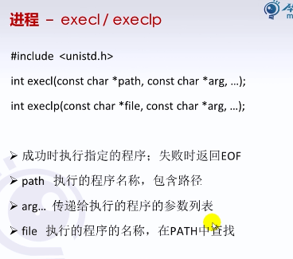

​		execl 子程序执行其他程序，与父程序不同。

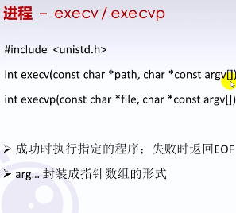

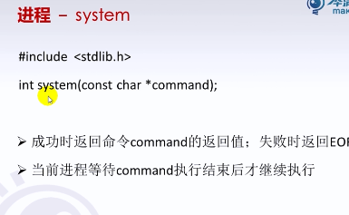

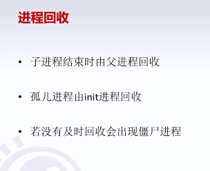

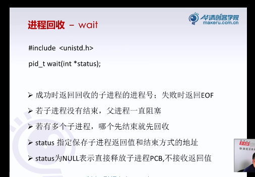

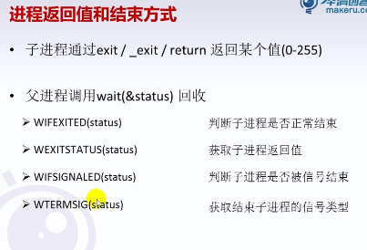

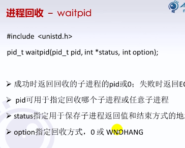

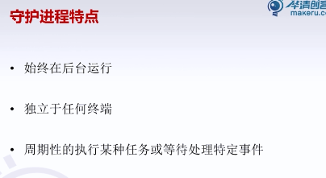

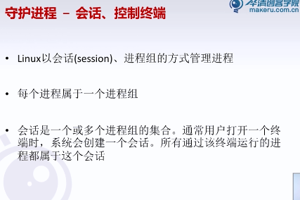

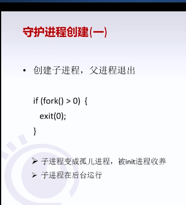

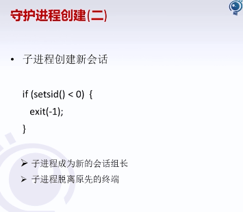

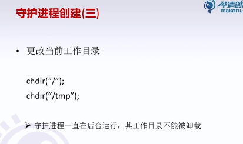

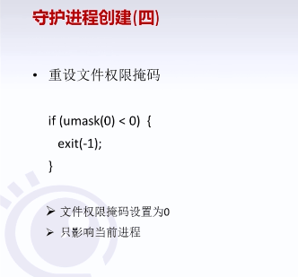

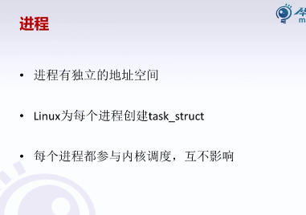

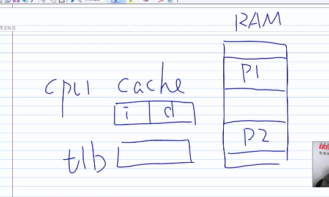

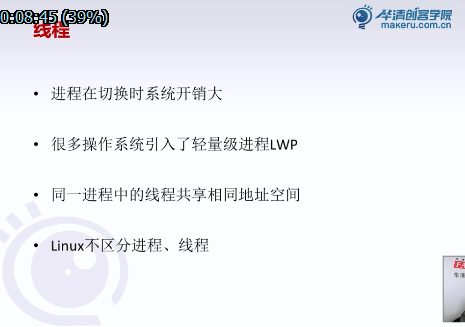

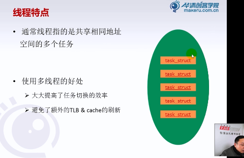

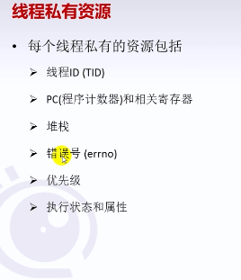

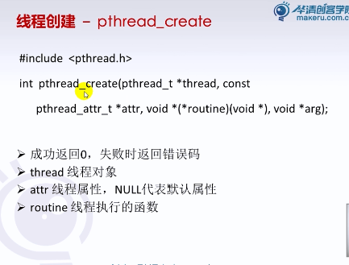

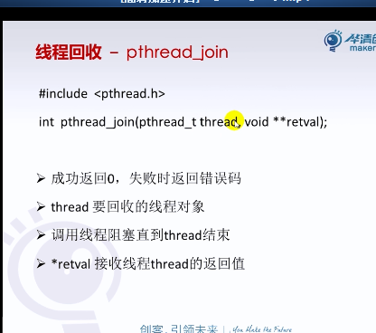

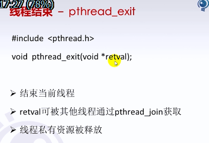

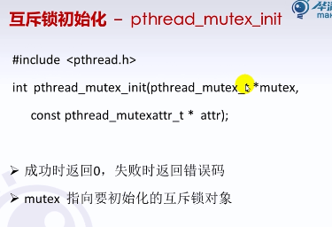

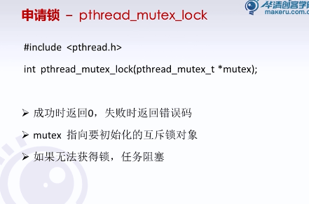

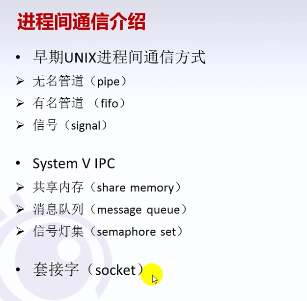

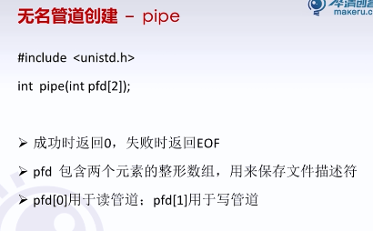

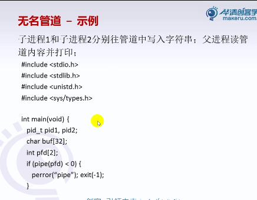

无名管道没有存放数据的文件，所以数据是存放在内存中的，而且数据读取后就不存在了

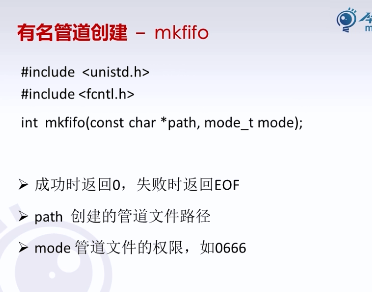

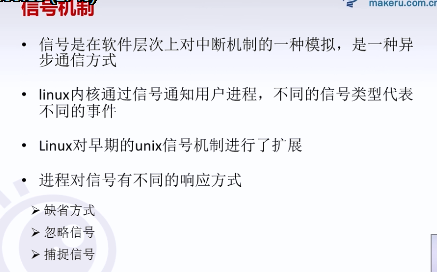

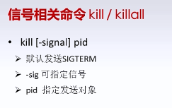

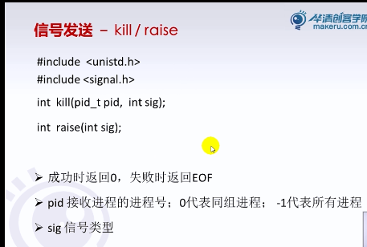

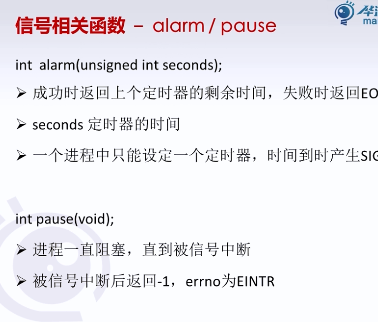

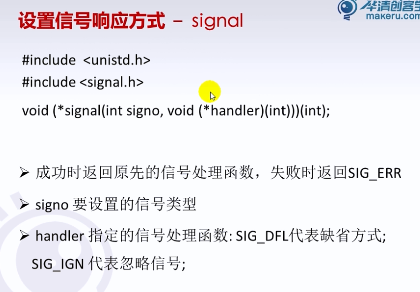

