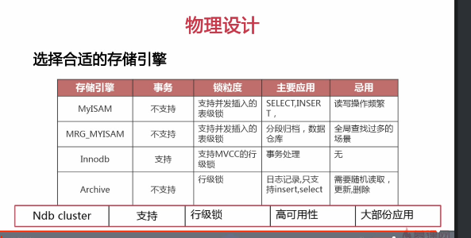
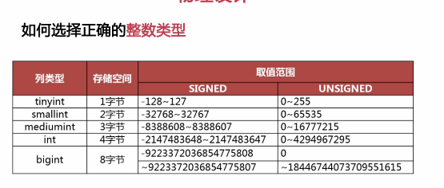
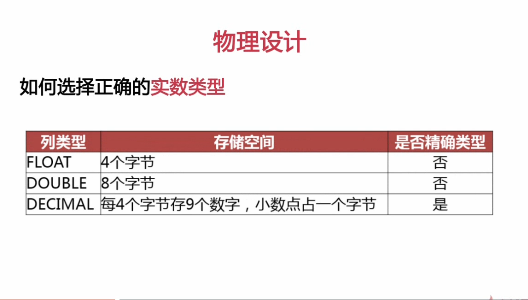

#### 数据库结构设计

优化目的：

1. 减少数据冗余

2. 尽量避免数据维护中出现更新，插入，删除异常。

     插入异常：如果表中的某个实体随着另一个实体存在而存在。

   更新异常：如果更改表中的某个实体的单独属性时，需要对多行进行更新。

   删除异常：如果删除表中的某一实体则会导致其他实体的消失。

3. 节约数据存储空间。

#### 数据库结构设计的步骤

需求分析：全面了解产品设计的存储需求。

1. 存储需求
2. 数据处理需求
3. 数据的安全性和完整性

逻辑设计：设计数据的逻辑存储结构

1. 数据实体之间的逻辑关系，解决数据冗余和数据维护异常

物理设计：根据所使用的数据库特点进行表结构设计

#### 数据库设计范式

##### 第一范式 ：

1. 数据库表中的所以字段都只具有单一属性
2. 单一属性的列是由基本的数据类型所构成的
3. 设计出来的表都是简单的二维表。

##### 第二范式：

要求一个表中只具有一个业务主键，也就是说符合第二范式的表中不能存在非主键列对只对部分主键的依赖关系

##### 第三范式：

指每一个非主属性既不部分依赖于也不传递依赖于业务主键，也就是在第二范式的基础上消除了非主属性对主键的依赖传递。

#### 需求分析

#### 物理设计

1.定义数据库、表及字段的命名规范

数据库、表及字段的命名要遵守可读性原则

数据库、表及字段的命名要遵守表意原则

数据库、表及字段的命名要遵守长名原则

2.存储引擎

3.为字段选择合适的数据类型

当一个列可以选择多种数据类型时，应该优先考虑数字类型，其次是日期和二进制类型，最后是字符类型。对于相同级别的数据类型，应该优先选择占用空间小的数据类型。

非精确：非精确的数据类型相加得到的值会有一些误差。

对于财务类型的字段应该使用decimal数据类型

mysql5.7之前对于varchar类型的长度进行修改无论是改大还是改小都是要锁表的。5.7之后长度在255中并且更改的也在255中不锁表。

