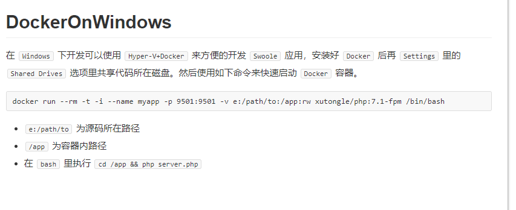
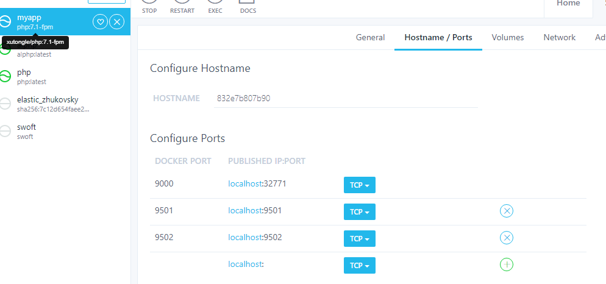

# 环境依赖

   

```
docker run --rm -t -i --name myapp -p 9501:9501 -v D:/dockwork/swoole:/app:rw xutongle/php:7.1-fpm /bin/bash

```

   docker 进入运行中的镜像

docker exec -it image_name /bin/bash

docker exec -it myapp /bin/bash





