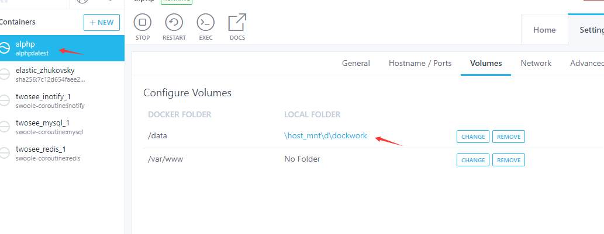

安装

​	

​	第一步 docker 

运行 alphp 镜像




​		第二步 win10  使用composer.cn.json 进行安装

```
git clone https://github.com/swoft-cloud/swoft
cd swoft
将 composer.cn.json 更改为composer.json

composer install --ignore-platform-reqs -vvv

//--ignore-platform-reqs 是忽略本身的环境进行安装

```


