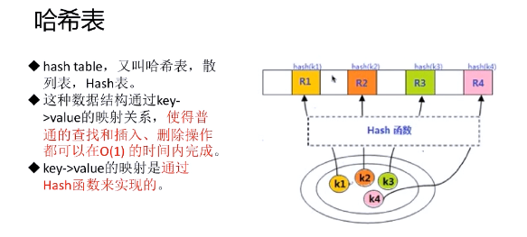
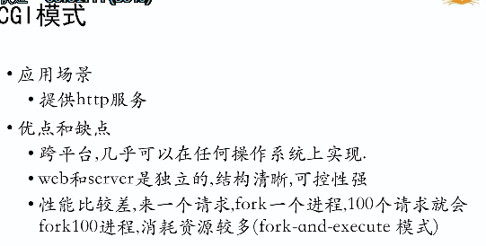

## 第一章 导论

### 学习图谱

1.php技术的深度学习

- PHP字符串处理
- PHP数组使用
- PHP高级特性
- PHP文件操作
- PHP选项和运行原理

2.web技术的广度和深度拓展

- linux使用
- javaScript精髓
- 深入HTTP协议
- MySql高级使用
- NoSql技术及应用

3.编程思想和综合能力的拓展

- 好代码的原则和技巧
- PHP数据结构
- PHP设计模式
- 常见开源系统分析
- 大规模网址开放技术

## 第二章 字符编码原理

#### 一.字符串语法

​	字符串的表达方式

- ​		单引号
- 双引号
- heredoc 语法结构
- nowdoc 语法结构


双引号到底解析哪些字符

- 当字符串用双引号或heredoc结构定义时，其中的变量将会被解析。
- \n,\r,\t,\v,\e,\f,\ $,\ \ , \"
- \ [0-7]{1,3} 符合改正则表达式序列的是一个以八进制方式来表达的字符
- \ x[0-9A-Fa-f]{1,2} 符合改正则表达式序列的是一个以十六进制方式表达的字符串

底层C语言中怎么表示PHP字符串

```c
struct{
    char *val;
    int len;
}str;
```

- ​	字节组成的数组可以使用[]或者{}访问某个字符
- 字符串长度可以达到2G内存
- 常见函数都是单字节处理方式
- 可以用[]或者{}访问某个字符
- PHP字符串是二进制安全的  \0

```php
<?php
    $str='a';
	$str[10]='e';
	echo $str;
	echo PHP_EOL    //PHP_EOL代表php的换行符，这个变量会根据平台而变，在windows下会是/r/n，在linux下是/n，在mac下是/r
   
    //结果输出 'a    e';
    //表明用超出字符串长度的下标写入将会拉长该字符串并以空格填充。
        
        
```

字符串存取总结

- string中的字符可以通过一个从0开始的下标，用类似array结构中的方括号包含对应的数字来访问和修改，比如$str[42]
- 也可以用花括号访问，比如$str{42}。数组可以这么访问么？
- 用超出字符串长度的下标写入将会拉长该字符串并以空格填充
- 非整数类型下标会被转换成整数。非法下标类型会产生一个E_NOTICE级别错误。

串行化

把一些不方面存储的保存的数据比如数组，转变成字符串。

- 函数serialize()可以实现
- 函数json_encode()可以实现
- 函数var_export（$items,true）

字符集和字符编码

#### 正则表达式

完整的正则表达式由两种字符组成。特殊字符（元字符）和普通字符（文本）


#### PHP编码技巧

四项基本原则

- 正确的实现功能
- 执行速度要快
- 占用系统资源少
- 后期维护方便

好的习惯

好的命名十分重要

-  命名要有实际含义
- 命名风格保持一致
- 不要用拼音命名
- 不用语言关键字

适当的使用注释

- 好的代码应该是自描述的
- 难以理解的地方加上注释
- 函数的功能加上注释说明
- 类的功能和使用方法加注释

变量要初始化

优先使用单引号   $row['id']的效率是$riw[id]的7倍

 用 if(1 == $a) 代替  if($a==1)

 防御式编程思想 

用自己可控的环境参数

- 明确包含文件的路径（优先使用绝对路径）
- 给予适当的默认值
- 自定义错误报警的级别
- 不依赖系统环境参数，程序要动态了解所处的环境

不要相信外部的一切输入

在纯php代码 中省略 ?>结束标记  

编码问题   php文件，模板编码，数据库编码都是utf-8

指定错误级别   error_reporting(7) 1:E_ERROR 2 : E_WARNING 4:E_PARSE

优先使用内置函数


时刻备份源代码 ： 

- 代码不能只有一份
- 应用编辑器的自动备份
- 用代码管理工具备份

记住有效期原则 ：不要随便相信网上的那些php优化50则之类的东西，记住一切都是有有效期，要善于自己去验证/

PHP语法糖

1.echo 多个变量时使用逗号而不是点号

```php
$foo = 'hello';
$bar = ' world';
echo $foo,$bar   //直接输出，效率高
echo  $foo.$bar  //中间的链接操作，会有一个中间变量，占用内存高

```

2. 用 $i+=1代替 $i = $i +1;
3. 用isset代替strlen
4. strtr代替str_replace (strtr是str_replace的四倍)
5. 使用yield实现协程
6. 使用[] 定义数组
7. 用'星号'进行幂运算  2**3
8. 用"..." 定义变长参数数组
9. 


PHP内置结构和函数

- echo()
- print()
- ### die()
- isset()
- unset()
- include(),include_once()
- require(),require_once()
- array()
- list()
- empty()
- eval()

这些内置结构要比函数要高


PHP_EOL  


## PHP数组

#### 数组的定义 

数组key 和value的限制条件

数组的访问

数组的删除 数组unset后，不会重建索引  array_splice

数组内部实现


hashTable 哈希表   时间复杂度都是O(1)





## PHP文件


## PHP内核架构





