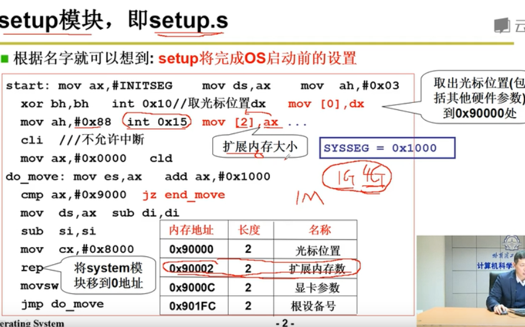
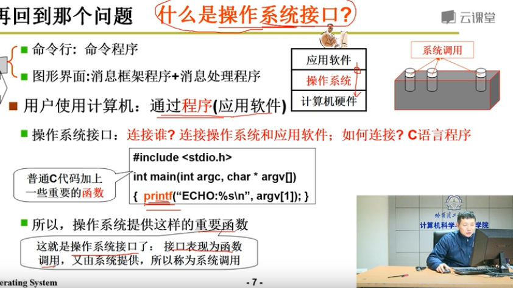
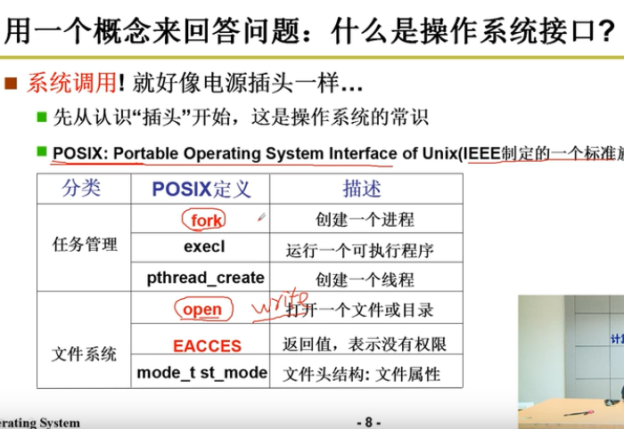
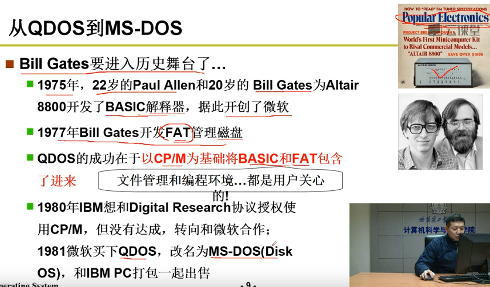
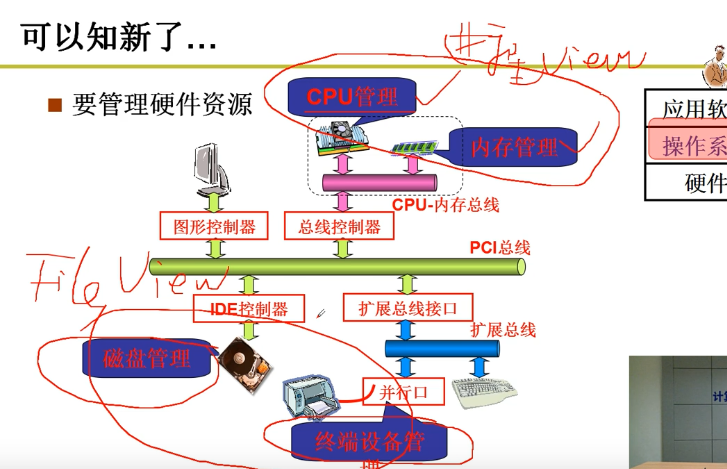
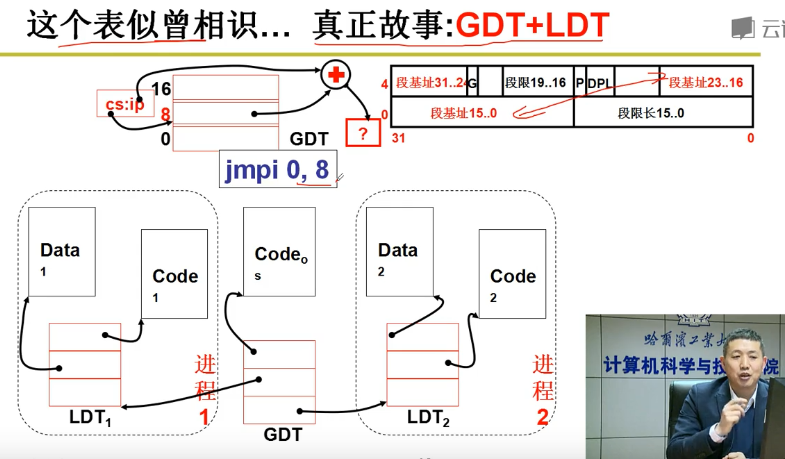

# 操作系统

## 第一章什么是操作系统

用计算机帮助人们解决一些实际问题

​		

​	

## 第二章 计算机

### 计算机是怎么工作的

把程序存到内存里，然后通过(ip/pc)指针 ，标识现在正在执行的哪条指令，将指令载入到cpu里解释执行

## 第三章 操作系统启动

操作启动就做了两件事

1.bootset  将操作系统从磁盘读入内存

2.setup  接管硬件，进行初始化（获取内存大小，显卡型号），生成GDT表TDT表，建立系统

## 第四章 操作系统的接口

怎么使用计算机呢 ：就是普通的C代码加上 一些重要函数（控制屏幕的printf）

## 第五章系统调用的实现

## 第六章 操作系统历史

 

第七章 我们的任务

第八章 CPU管理

## 第十章 用户级线程

## 第11章  内核级线程

## 第二十章  内存的使用和分段

第二十一章 内存分区与分页

